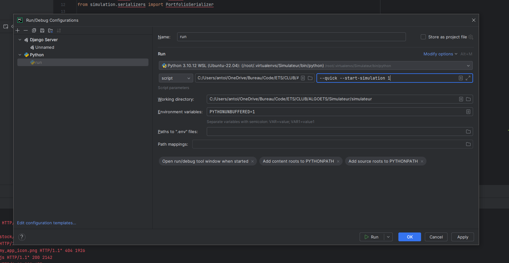

# Simulateur


## Project Overview

Simulateur is a stock market simulation platform built using Django. The platform allows users to create and manage scenarios to simulate stock market events and track their outcomes. 
It includes an admin interface to manage the simulation settings and control the flow of the simulation.


## Features

- Create and manage companies with detailed backstories and stock information.
- Simulate stock market events and scenarios.
- Manage teams and user profiles with financial details.
- Admin dashboard to control simulation parameters and monitor progress.
- Secure access and operations restricted to superadmins.

## Requirements

- Python 3.10
- Django 4.2.13

## Installation

Use pycharm professional or community



### Backend (Django)

## Run the Complete System

To run the complete system, you can use Docker Compose for setting up the entire environment with one command:

```bash
docker compose --profile all down
docker compose --profile all up -d --build
```


1. **Install Dependencies**:

    ```bash
    cd simulateur
    python3 -m run.py --install
    ```

2. **Run the Server**:

    ```bash
    python3 -m run.py --start-simulation 1
    ```

## Usage

### Superadmin Commands

To create a superadmin, use the Django management command:

```bash
python3 manage.py createsuperadmin --username=admin --password=admin --email=admin@admin.com
```

Follow the prompts to set up the superadmin credentials.

## Contributing

Contributions are welcome! Please fork the repository and create a pull request with your changes.

## License

This project is licensed under the MIT License

## Data

The project includes the following CSV files for initial data setup:

```plaintext
.
├── data
│   ├── scenarios.csv
│   ├── simulation_settings.csv
│   ├── companies.csv
│   ├── events.csv
│   ├── triggers.csv
│   ├── portfolios.csv
│   ├── stocks.csv
│   ├── teams.csv
│   └── users.csv
```

## File Structure

Here is a brief overview of the project file structure:

```plaintext
.
├── Dockerfile
├── data
├── db.sqlite3 # db
├── docker-compose.yml
├── manage.py
├── requirements.txt # packages
├── simulateur
│   ├── asgi.py # websocket and http
│   ├── settings.py
│   ├── urls.py
├── simulation
│   ├── admin.py
│   ├── apps.py
│   ├── channels # websocket
│   ├── logic # simulation logic
│   ├── models.py
│   ├── templates
│   ├── tests.py
│   ├── urls.py
│   └── views
```
